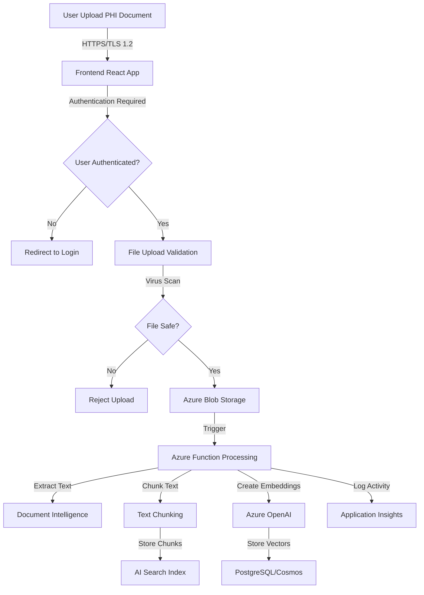
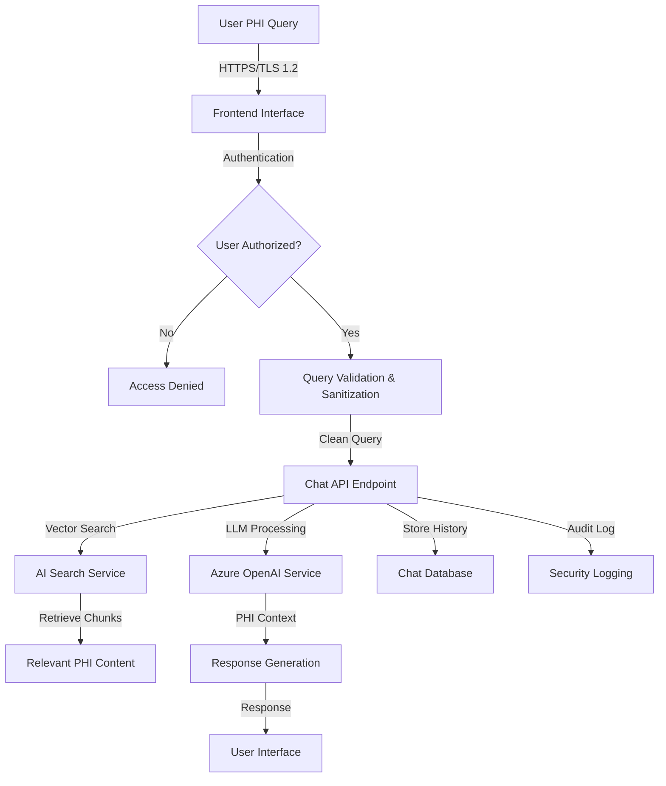
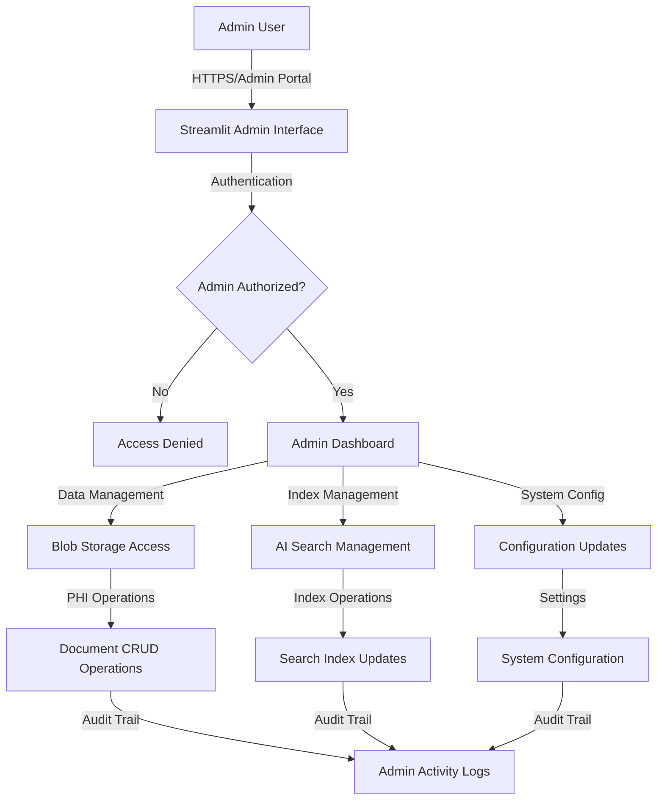

# [PHI] HIPAA-RAG Data Flow Security Analysis

**Classification**: PHI-CRITICAL  
**Document Version**: 1.0  
**Last Updated**: 2025-08-01  
**Security Review**: Required before any architecture changes

## Data Flow Overview

This document maps all PHI data flows through the HIPAA-RAG system, identifying security controls, vulnerabilities, and required protections at each stage.

---

## PHI Data Flow Architecture

### Level 1: System-Wide PHI Flow

```
[Healthcare Provider] ──────────► [HIPAA-RAG System] ──────────► [Healthcare Users]
         │                              │                              │
    [PHI Documents]                [Processing &                  [PHI Queries &
    [Medical Records]               Storage]                      Responses]
    [Patient Data]                      │                              │
                                   [Security                      [Audit Logs]
                                   Boundary]                      [Access Controls]
```

### Level 2: Detailed Component Flow

```
Internet Boundary
├── Azure Front Door (CDN/WAF)
│   ├── DDoS Protection: ✅ Enabled
│   ├── WAF Rules: ❌ PHI-specific rules needed
│   └── TLS Termination: ✅ TLS 1.2+
│
├── Virtual Network (Private)
│   ├── Network Security Groups: 🔄 Basic rules
│   ├── Private Endpoints: ❌ Not implemented
│   └── Network Flow Logs: ❌ Not configured
│
├── Application Gateway
│   ├── SSL Offloading: ✅ Enabled
│   ├── Request Routing: ✅ Configured
│   └── Health Probes: ✅ Configured
│
├── App Services (Frontend & Backend)
│   ├── Authentication: 🔄 Azure AD basic
│   ├── Authorization: ❌ No RBAC
│   ├── Session Management: ❌ Not configured
│   └── Input Validation: ❌ Not implemented
│
├── Azure Functions (Processing)
│   ├── Managed Identity: ✅ Enabled
│   ├── Key Vault Integration: 🔄 Basic setup
│   ├── Network Isolation: ❌ Not configured
│   └── Secure Logging: ❌ PHI-unsafe logs
│
├── Storage Services
│   ├── Blob Storage: 🔄 Standard encryption
│   ├── Database: 🔄 Standard encryption
│   ├── AI Search: 🔄 Standard encryption
│   └── Key Vault: ✅ Managed keys only
│
└── Monitoring & Logging
    ├── Application Insights: ❌ PHI in logs
    ├── Log Analytics: ❌ No PHI filtering
    └── Azure Monitor: ❌ No security alerts
```

---

## PHI Data Journey Mapping

### 1. Document Ingestion Flow



#### Security Controls Analysis

| Stage | Current Security | Required Security | Risk Level |
|-------|------------------|-------------------|------------|
| **File Upload** | HTTPS, basic validation | Input sanitization, malware scanning, file type validation | HIGH |
| **Authentication** | Azure AD OAuth | MFA enforcement, session management | HIGH |
| **Blob Storage** | Standard encryption | Customer-managed keys, private endpoints | CRITICAL |
| **Function Processing** | Managed identity | Secure memory handling, encrypted logs | HIGH |
| **AI Search Indexing** | Service encryption | Encrypted indexes, access logging | HIGH |
| **Database Storage** | Database encryption | Field-level encryption, audit trails | CRITICAL |
| **Logging** | Standard logging | PHI-safe logging, log encryption | MEDIUM |

### 2. Query Processing Flow



#### Security Controls Analysis

| Stage | Current Security | Required Security | Risk Level |
|-------|------------------|-------------------|------------|
| **Query Input** | Basic HTTPS | Input validation, query sanitization, rate limiting | HIGH |
| **Authentication** | Azure AD | MFA, RBAC, session timeout | HIGH |
| **Vector Search** | Service encryption | Encrypted indexes, query auditing | HIGH |
| **LLM Processing** | Azure service security | BAA compliance, request/response logging | CRITICAL |
| **Response Generation** | Standard transmission | Response filtering, PHI detection | HIGH |
| **Chat Storage** | Database encryption | Field encryption, retention policies | CRITICAL |
| **Audit Logging** | Basic logging | Structured audit logs, SIEM integration | HIGH |

### 3. Administrative Access Flow



#### Security Controls Analysis

| Stage | Current Security | Required Security | Risk Level |
|-------|------------------|-------------------|------------|
| **Admin Authentication** | Basic Azure AD | MFA, privileged access management | CRITICAL |
| **Administrative Actions** | Basic logging | Comprehensive audit trails, approval workflows | CRITICAL |
| **Data Management** | Standard access | Role-based permissions, data lineage tracking | CRITICAL |
| **System Configuration** | Direct access | Change management, configuration versioning | HIGH |

---

## Security Boundary Analysis

### Trust Boundaries

#### 1. Internet → Azure Cloud (External Boundary)
- **Current Controls**: Azure Front Door, DDoS protection, basic WAF
- **Required Controls**: PHI-specific WAF rules, geo-blocking, threat intelligence
- **Vulnerabilities**: No PHI-specific filtering, limited attack detection

#### 2. Public Cloud → Private Network (Network Boundary)
- **Current Controls**: Virtual Network, basic NSGs
- **Required Controls**: Private endpoints, network segmentation, micro-segmentation
- **Vulnerabilities**: Public endpoints exposed, no network isolation

#### 3. Application → Data Layer (Data Boundary)
- **Current Controls**: Managed identities, basic encryption
- **Required Controls**: Customer-managed keys, field-level encryption, access controls
- **Vulnerabilities**: Standard encryption keys, no granular access controls

#### 4. Processing → Storage (Processing Boundary)
- **Current Controls**: Function isolation, basic security
- **Required Controls**: Secure memory handling, encrypted processing, audit logging
- **Vulnerabilities**: PHI in memory, insufficient processing security

### Data Loss Prevention (DLP) Controls

#### Required DLP Implementation
```
User Input → DLP Scanner → PHI Detection → Classification → Protection
    ↓              ↓             ↓              ↓             ↓
[Query Text] → [Pattern     → [PHI Found]   → [HIGH Risk]  → [Encrypt &
              Matching]                                      Audit]
```

#### DLP Rules Configuration
- **Pattern Detection**: SSN, MRN, phone numbers, addresses, dates of birth
- **Context Analysis**: Medical terminology, diagnostic codes, treatment plans
- **Action Triggers**: Encrypt, audit, alert, block (based on sensitivity)
- **Remediation**: Automatic PHI masking, manual review queue

---

## Encryption and Protection Layers

### Encryption at Rest

#### Current Implementation
```
Azure Storage Account
├── Blob Storage: Microsoft-managed keys (AES-256)
├── Database/Cosmos: Service-managed encryption
├── AI Search: Service-managed encryption
└── Application Insights: Service-managed encryption
```

#### Required Implementation
```
HIPAA-Compliant Storage
├── Blob Storage: Customer-managed keys (CMK) with Azure Key Vault
├── Database: Field-level encryption with CMK
├── AI Search: Encrypted indexes with CMK
└── Logs: Encrypted log storage with PHI filtering
```

### Encryption in Transit

#### Current Implementation
- TLS 1.2+ for all HTTP communications
- Azure service-to-service encryption
- Standard certificate management

#### Required Implementation
- TLS 1.3 with certificate pinning
- End-to-end encryption for PHI
- Mutual TLS for service authentication
- Certificate lifecycle management

### Encryption in Processing

#### Current Gaps
- PHI in function memory (unencrypted)
- LLM API calls (standard encryption only)
- Processing logs (potential PHI exposure)

#### Required Implementation
- Secure memory handling for PHI
- Encrypted processing environments
- PHI-safe logging and monitoring
- Secure disposal of processing artifacts

---

## Access Control Flow

### Authentication Flow
```
User Request → Azure AD → MFA Challenge → Token Validation → RBAC Check → Access Granted/Denied
     ↓             ↓           ↓              ↓               ↓              ↓
[Credentials] → [Identity   → [Additional → [JWT Token]   → [Role        → [PHI Access
              Verification]   Factor]                      Permissions]    or Denial]
```

### Authorization Matrix

| Role | PHI Read | PHI Write | Admin | Config | Audit |
|------|----------|-----------|-------|--------|-------|
| **End User** | Limited | No | No | No | No |
| **Healthcare Provider** | Full | Limited | No | No | No |
| **System Admin** | No | No | Yes | Yes | Limited |
| **Security Officer** | Audit Only | No | Limited | Security | Full |
| **Compliance Officer** | Audit Only | No | No | No | Full |

---

## Audit and Monitoring Flow

### Audit Event Flow
```
User Action → Event Generation → PHI Detection → Classification → Secure Storage → SIEM Analysis
     ↓              ↓                ↓              ↓               ↓               ↓
[PHI Access] → [Structured      → [PHI Present?] → [Security   → [Encrypted    → [Alert/
              Log Event]                           Level]        Audit Store]    Report]
```

### Required Audit Events

#### High-Priority Events (Real-time Monitoring)
- PHI access attempts (successful and failed)
- Administrative privilege usage
- System configuration changes
- Security control modifications
- Abnormal data access patterns

#### Medium-Priority Events (Daily Review)
- User authentication events
- File upload/download activities
- Search query patterns
- System performance anomalies

#### Low-Priority Events (Weekly Review)
- Regular system operations
- Scheduled maintenance activities
- Routine backup operations

---

## Risk Assessment Summary

### Critical Data Flow Risks

#### 1. Unencrypted PHI Processing (Risk Score: 25)
- **Location**: Azure Functions memory
- **Impact**: Complete PHI exposure during processing
- **Mitigation**: Implement secure memory handling, encrypted processing environments

#### 2. Insufficient Access Controls (Risk Score: 20)
- **Location**: All PHI access points
- **Impact**: Unauthorized PHI access
- **Mitigation**: Implement RBAC, MFA, session management

#### 3. PHI in Logs (Risk Score: 18)
- **Location**: Application Insights, diagnostic logs
- **Impact**: PHI exposure in monitoring systems
- **Mitigation**: Implement PHI-safe logging, log encryption

#### 4. No Network Isolation (Risk Score: 16)
- **Location**: All service communications
- **Impact**: Network-based attacks on PHI
- **Mitigation**: Deploy private endpoints, network segmentation

### Immediate Actions Required

1. **Deploy Customer-Managed Encryption Keys** (30 days)
2. **Implement Private Endpoints** (45 days)
3. **Configure PHI-Safe Logging** (30 days)
4. **Deploy Comprehensive Audit Logging** (60 days)
5. **Implement RBAC and MFA** (45 days)

---

## Compliance Validation

### HIPAA Security Rule Mapping

| Data Flow Stage | HIPAA Requirement | Current Status | Required Action |
|------------------|-------------------|----------------|-----------------|
| **User Authentication** | §164.312(d) | Partial | Implement MFA |
| **PHI Access Control** | §164.312(a) | Non-compliant | Deploy RBAC |
| **PHI Transmission** | §164.312(e) | Basic | Enhanced encryption |
| **PHI Storage** | §164.312(a)(2)(iv) | Non-compliant | Customer-managed keys |
| **Audit Controls** | §164.312(b) | Non-compliant | Comprehensive logging |
| **Integrity Controls** | §164.312(c) | Partial | Data integrity monitoring |

---

**Next Review**: Monthly review required until all critical risks are mitigated.  
**Approval Required**: Security Officer and Compliance Team must approve any data flow changes.  
**Distribution**: Restricted to authorized security and development personnel only.